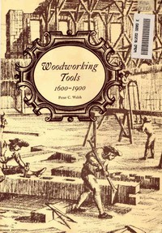

# Woodworking Tools 1600-1900 <kbd>v2.3.0</kbd>

## Authors

 - Welsh, Peter C. <small>(-1 - -1)</small>

## Translators

## Subjects

 - Woodworking tools

## Readablility

 - **A1:** 65%
 - **A2:** 72%
 - **B1:** 79%
 - **B2:** 86%
 - **C1:** 95%
 - **C2:** 100%

## Words Count

 - **A1:** 342
 - **A2:** 218
 - **B1:** 344
 - **B2:** 426
 - **C1:** 417
 - **C2:** 253

## Source

<kbd>GUTHENBURGE:27238</kbd>
