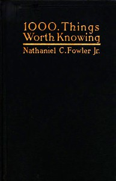

# 1000 Things Worth Knowing <kbd>v2.2.1</kbd>

## Authors

 - Fowler, Nathaniel C. (Nathaniel Clark) <small>(1858 - 1918)</small>

## Translators

## Subjects

 - Encyclopedias and dictionaries

## Readablility

 - **A1:** 67%
 - **A2:** 74%
 - **B1:** 82%
 - **B2:** 90%
 - **C1:** 95%
 - **C2:** 100%

## Words Count

 - **A1:** 459
 - **A2:** 421
 - **B1:** 680
 - **B2:** 945
 - **C1:** 1070
 - **C2:** 861

## Source

<kbd>GUTHENBURGE:56796</kbd>
