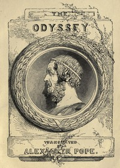

# The Odyssey <kbd>v2.3.0</kbd>

## Authors

 - Homer <small>(-750 - -650)</small>

## Translators

 - Pope, Alexander <small>(1688 - 1744)</small>

## Subjects

 - Epic poetry, Greek
 - Homer
 - Odysseus, King of Ithaca (Mythological character)

## Readablility

 - **A1:** 67%
 - **A2:** 73%
 - **B1:** 81%
 - **B2:** 89%
 - **C1:** 96%
 - **C2:** 100%

## Words Count

 - **A1:** 483
 - **A2:** 454
 - **B1:** 812
 - **B2:** 1341
 - **C1:** 1747
 - **C2:** 1443

## Source

<kbd>GUTHENBURGE:3160</kbd>
