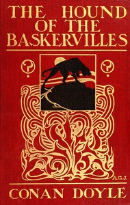

# The Hound of the Baskervilles <kbd>v2.2.0</kbd>

## Authors

 - Doyle, Arthur Conan <small>(1859 - 1930)</small>

## Translators

## Subjects

 - Blessing and cursing
 - Dartmoor (England)
 - Detective and mystery stories
 - Dogs
 - Holmes, Sherlock (Fictitious character)
 - Private investigators

## Readablility

 - **A1:** 78%
 - **A2:** 83%
 - **B1:** 89%
 - **B2:** 94%
 - **C1:** 98%
 - **C2:** 100%

## Words Count

 - **A1:** 1674
 - **A2:** 456
 - **B1:** 794
 - **B2:** 1139
 - **C1:** 1167
 - **C2:** 648

## Source

<kbd>GUTHENBURGE:2852</kbd>
