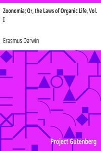

# Zoonomia; Or, the Laws of Organic Life, Vol. I <kbd>v2.2.1</kbd>

## Authors

 - Darwin, Erasmus <small>(1731 - 1802)</small>

## Translators

## Subjects

 - Evolution (Biology)
 - Medicine
 - Pathology
 - Physiology

## Readablility

 - **A1:** 71%
 - **A2:** 77%
 - **B1:** 83%
 - **B2:** 89%
 - **C1:** 96%
 - **C2:** 99%

## Words Count

 - **A1:** 483
 - **A2:** 452
 - **B1:** 786
 - **B2:** 1209
 - **C1:** 1547
 - **C2:** 1303

## Source

<kbd>GUTHENBURGE:15707</kbd>
