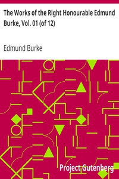

# The Works of the Right Honourable Edmund Burke, Vol. 01 (of 12) <kbd>v2.2.1</kbd>

## Authors

 - Burke, Edmund <small>(1729 - 1797)</small>

## Translators

## Subjects

 - Great Britain
 - Political science

## Readablility

 - **A1:** 74%
 - **A2:** 80%
 - **B1:** 87%
 - **B2:** 93%
 - **C1:** 98%
 - **C2:** 100%

## Words Count

 - **A1:** 488
 - **A2:** 466
 - **B1:** 876
 - **B2:** 1480
 - **C1:** 1954
 - **C2:** 1463

## Source

<kbd>GUTHENBURGE:15043</kbd>
