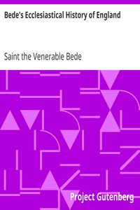

# Bede's Ecclesiastical History of England <kbd>v2.2.1</kbd>

## Authors

 - Bede, the Venerable, Saint <small>(673 - 735)</small>

## Translators

 - Sellar, A. M. <small>(-1 - -1)</small>

## Subjects

 - England

## Readablility

 - **A1:** 77%
 - **A2:** 82%
 - **B1:** 88%
 - **B2:** 93%
 - **C1:** 98%
 - **C2:** 100%

## Words Count

 - **A1:** 493
 - **A2:** 468
 - **B1:** 848
 - **B2:** 1382
 - **C1:** 1630
 - **C2:** 1025

## Source

<kbd>GUTHENBURGE:38326</kbd>
