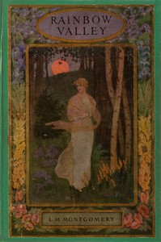

# Rainbow Valley <kbd>v2.3.0</kbd>

## Authors

 - Montgomery, L. M. (Lucy Maud) <small>(1874 - 1942)</small>

## Translators

## Subjects

 - Brothers and sisters
 - Canada
 - Family life
 - Foster home care
 - Friendship
 - Historical fiction
 - Orphans
 - Prince Edward Island

## Readablility

 - **A1:** 79%
 - **A2:** 85%
 - **B1:** 90%
 - **B2:** 94%
 - **C1:** 97%
 - **C2:** 100%

## Words Count

 - **A1:** 486
 - **A2:** 449
 - **B1:** 797
 - **B2:** 1162
 - **C1:** 1228
 - **C2:** 867

## Source

<kbd>GUTHENBURGE:5343</kbd>
