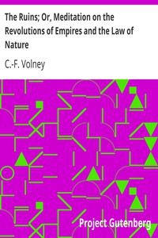

# The Ruins; Or, Meditation on the Revolutions of Empires and the Law of Nature <kbd>v2.0.2</kbd>

## Authors

 - Volney, C.-F. (Constantin-François) <small>(1757 - 1820)</small>

## Translators

## Subjects

 - Ethics
 - History
 - Religions
 - Revolutions

## Readablility

 - **A1:** 51%
 - **A2:** 58%
 - **B1:** 69%
 - **B2:** 83%
 - **C1:** 86%
 - **C2:** 100%

## Words Count

 - **A1:** 580
 - **A2:** 570
 - **B1:** 1003
 - **B2:** 1653
 - **C1:** 663
 - **C2:** 5370

## Source

<kbd>GUTHENBURGE:1397</kbd>
