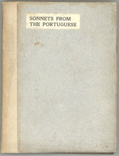

# Sonnets from the Portuguese <kbd>v2.3.0</kbd>

## Authors

 - Browning, Elizabeth Barrett <small>(1806 - 1861)</small>

## Translators

## Subjects

 - Love poetry, English
 - Sonnets, English

## Readablility

 - **A1:** 72%
 - **A2:** 80%
 - **B1:** 87%
 - **B2:** 94%
 - **C1:** 98%
 - **C2:** 100%

## Words Count

 - **A1:** 387
 - **A2:** 246
 - **B1:** 308
 - **B2:** 351
 - **C1:** 238
 - **C2:** 125

## Source

<kbd>GUTHENBURGE:2002</kbd>
