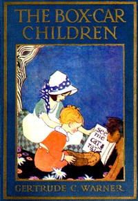

# The Box-Car Children <kbd>v2.3.0</kbd>

## Authors

 - Warner, Gertrude Chandler <small>(1890 - 1979)</small>

## Translators

## Subjects

 - Adventure and adventurers
 - Boxcar children (Fictitious characters)
 - Brothers and sisters
 - Children
 - Conduct of life
 - Families
 - Orphans

## Readablility

 - **A1:** 75%
 - **A2:** 82%
 - **B1:** 89%
 - **B2:** 94%
 - **C1:** 98%
 - **C2:** 100%

## Words Count

 - **A1:** 468
 - **A2:** 361
 - **B1:** 539
 - **B2:** 643
 - **C1:** 522
 - **C2:** 264

## Source

<kbd>GUTHENBURGE:42796</kbd>
