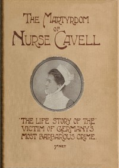

# The martyrdom of Nurse Cavell: The life story of the victim of Germany's most barbarous crime <kbd>v2.3.0</kbd>

## Authors

 - Hill, William Thomson <small>(1875 - -1)</small>

## Translators

## Subjects

 - Cavell, Edith, 1865-1915
 - Nurses

## Readablility

 - **A1:** 73%
 - **A2:** 80%
 - **B1:** 87%
 - **B2:** 94%
 - **C1:** 98%
 - **C2:** 100%

## Words Count

 - **A1:** 435
 - **A2:** 280
 - **B1:** 385
 - **B2:** 455
 - **C1:** 343
 - **C2:** 126

## Source

<kbd>GUTHENBURGE:68149</kbd>
