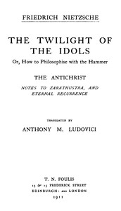

# The Twilight of the Idols; or, How to Philosophize with the Hammer. The Antichrist: Complete Works, Volume Sixteen <kbd>v2.3.0</kbd>

## Authors

 - Nietzsche, Friedrich Wilhelm <small>(1844 - 1900)</small>

## Translators

 - Ludovici, Anthony M. (Anthony Mario) <small>(1882 - 1971)</small>

## Subjects

 - Philosophy

## Readablility

 - **A1:** 74%
 - **A2:** 79%
 - **B1:** 85%
 - **B2:** 92%
 - **C1:** 97%
 - **C2:** 100%

## Words Count

 - **A1:** 480
 - **A2:** 417
 - **B1:** 746
 - **B2:** 1131
 - **C1:** 1355
 - **C2:** 1095

## Source

<kbd>GUTHENBURGE:52263</kbd>
