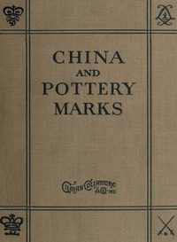

# China and Pottery Marks <kbd>v2.3.0</kbd>

## Authors

 - Unknown <small>(-1 - -1)</small>

## Translators

## Subjects

 - Pottery

## Readablility

 - **A1:** 67%
 - **A2:** 75%
 - **B1:** 84%
 - **B2:** 91%
 - **C1:** 98%
 - **C2:** 100%

## Words Count

 - **A1:** 231
 - **A2:** 109
 - **B1:** 162
 - **B2:** 186
 - **C1:** 127
 - **C2:** 46

## Source

<kbd>GUTHENBURGE:40311</kbd>
