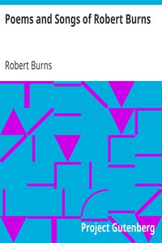

# Poems and Songs of Robert Burns <kbd>v2.3.0</kbd>

## Authors

 - Burns, Robert <small>(1759 - 1796)</small>

## Translators

## Subjects

 - Scotland
 - Songs, Scots

## Readablility

 - **A1:** 74%
 - **A2:** 78%
 - **B1:** 84%
 - **B2:** 89%
 - **C1:** 95%
 - **C2:** 100%

## Words Count

 - **A1:** 491
 - **A2:** 467
 - **B1:** 834
 - **B2:** 1368
 - **C1:** 1950
 - **C2:** 1878

## Source

<kbd>GUTHENBURGE:1279</kbd>
