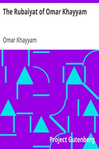

# The Rubaiyat of Omar Khayyam <kbd>v2.3.0</kbd>

## Authors

 - Omar Khayyam <small>(1048 - 1122)</small>

## Translators

 - FitzGerald, Edward <small>(1809 - 1883)</small>

## Subjects

 - Persian poetry

## Readablility

 - **A1:** 73%
 - **A2:** 78%
 - **B1:** 85%
 - **B2:** 91%
 - **C1:** 97%
 - **C2:** 100%

## Words Count

 - **A1:** 437
 - **A2:** 299
 - **B1:** 400
 - **B2:** 521
 - **C1:** 456
 - **C2:** 292

## Source

<kbd>GUTHENBURGE:246</kbd>
