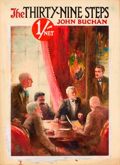

# The Thirty-Nine Steps <kbd>v2.2.1</kbd>

## Authors

 - Buchan, John <small>(1875 - 1940)</small>

## Translators

## Subjects

 - Hannay, Richard (Fictitious character)
 - Intelligence service
 - Spy stories
 - World War, 1914-1918

## Readablility

 - **A1:** 77%
 - **A2:** 83%
 - **B1:** 89%
 - **B2:** 94%
 - **C1:** 98%
 - **C2:** 100%

## Words Count

 - **A1:** 480
 - **A2:** 428
 - **B1:** 670
 - **B2:** 944
 - **C1:** 977
 - **C2:** 573

## Source

<kbd>GUTHENBURGE:558</kbd>
