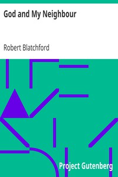

# God and My Neighbour <kbd>v2.3.0</kbd>

## Authors

 - Blatchford, Robert <small>(1851 - 1943)</small>

## Translators

## Subjects

 - Agnosticism

## Readablility

 - **A1:** 76%
 - **A2:** 81%
 - **B1:** 87%
 - **B2:** 93%
 - **C1:** 97%
 - **C2:** 100%

## Words Count

 - **A1:** 492
 - **A2:** 441
 - **B1:** 787
 - **B2:** 1138
 - **C1:** 1283
 - **C2:** 843

## Source

<kbd>GUTHENBURGE:6172</kbd>
