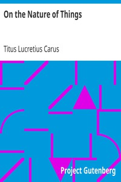

# On the Nature of Things <kbd>v2.3.0</kbd>

## Authors

 - Lucretius Carus, Titus <small>(-95 - -55)</small>

## Translators

 - Leonard, William Ellery <small>(1876 - 1944)</small>

## Subjects

 - Didactic poetry, Latin
 - Philosophy, Ancient

## Readablility

 - **A1:** 73%
 - **A2:** 78%
 - **B1:** 84%
 - **B2:** 91%
 - **C1:** 97%
 - **C2:** 100%

## Words Count

 - **A1:** 473
 - **A2:** 388
 - **B1:** 673
 - **B2:** 1058
 - **C1:** 1248
 - **C2:** 1088

## Source

<kbd>GUTHENBURGE:785</kbd>
