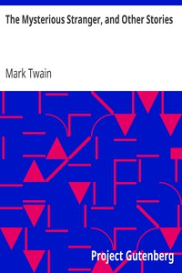

# The Mysterious Stranger, and Other Stories <kbd>v2.0.2</kbd>

## Authors

 - Twain, Mark <small>(1835 - 1910)</small>

## Translators

## Subjects

 - Humorous stories, American
 - Short stories
 - United States

## Readablility

 - **A1:** 56%
 - **A2:** 63%
 - **B1:** 74%
 - **B2:** 87%
 - **C1:** 91%
 - **C2:** 100%

## Words Count

 - **A1:** 545
 - **A2:** 446
 - **B1:** 710
 - **B2:** 1059
 - **C1:** 439
 - **C2:** 2046

## Source

<kbd>GUTHENBURGE:3186</kbd>
