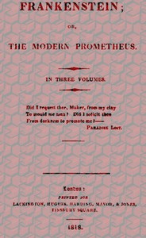

# Frankenstein; Or, The Modern Prometheus <kbd>v2.2.1</kbd>

## Authors

 - Shelley, Mary Wollstonecraft <small>(1797 - 1851)</small>

## Translators

## Subjects

 - Frankenstein's monster (Fictitious character)
 - Frankenstein, Victor (Fictitious character)
 - Gothic fiction
 - Horror tales
 - Monsters
 - Science fiction
 - Scientists

## Readablility

 - **A1:** 73%
 - **A2:** 79%
 - **B1:** 86%
 - **B2:** 94%
 - **C1:** 98%
 - **C2:** 100%

## Words Count

 - **A1:** 489
 - **A2:** 461
 - **B1:** 851
 - **B2:** 1343
 - **C1:** 1470
 - **C2:** 770

## Source

<kbd>GUTHENBURGE:41445</kbd>
