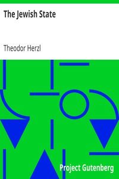

# The Jewish State <kbd>v2.3.0</kbd>

## Authors

 - Herzl, Theodor <small>(1860 - 1904)</small>

## Translators

## Subjects

 - Herzl, Theodor, 1860-1904
 - Zionism
 - Zionists

## Readablility

 - **A1:** 73%
 - **A2:** 79%
 - **B1:** 86%
 - **B2:** 92%
 - **C1:** 97%
 - **C2:** 100%

## Words Count

 - **A1:** 475
 - **A2:** 417
 - **B1:** 718
 - **B2:** 1052
 - **C1:** 1092
 - **C2:** 662

## Source

<kbd>GUTHENBURGE:25282</kbd>
