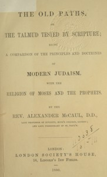

# The old paths, or the Talmud tested by Scripture: Being a comparison of the principles and doctrines of modern Judaism with the religion of Moses and the prophets <kbd>v2.2.1</kbd>

## Authors

 - McCaul, Alexander <small>(1799 - 1863)</small>

## Translators

## Subjects

 - Judaism

## Readablility

 - **A1:** 78%
 - **A2:** 83%
 - **B1:** 88%
 - **B2:** 93%
 - **C1:** 97%
 - **C2:** 100%

## Words Count

 - **A1:** 490
 - **A2:** 457
 - **B1:** 857
 - **B2:** 1362
 - **C1:** 1712
 - **C2:** 1159

## Source

<kbd>GUTHENBURGE:68214</kbd>
