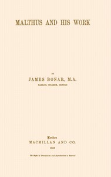

# Malthus and his work <kbd>v2.2.1</kbd>

## Authors

 - Bonar, James <small>(1852 - 1941)</small>

## Translators

## Subjects

 - Malthus, T. R. (Thomas Robert), 1766-1834
 - Malthusianism

## Readablility

 - **A1:** 73%
 - **A2:** 79%
 - **B1:** 86%
 - **B2:** 93%
 - **C1:** 97%
 - **C2:** 100%

## Words Count

 - **A1:** 487
 - **A2:** 462
 - **B1:** 827
 - **B2:** 1297
 - **C1:** 1614
 - **C2:** 1178

## Source

<kbd>GUTHENBURGE:68099</kbd>
