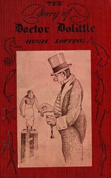

# The Story of Doctor Dolittle <kbd>v2.3.0</kbd>

## Authors

 - Lofting, Hugh <small>(1886 - 1947)</small>

## Translators

## Subjects

 - Animals
 - Fantasy literature
 - Human-animal communication

## Readablility

 - **A1:** 77%
 - **A2:** 84%
 - **B1:** 90%
 - **B2:** 95%
 - **C1:** 98%
 - **C2:** 100%

## Words Count

 - **A1:** 468
 - **A2:** 347
 - **B1:** 487
 - **B2:** 566
 - **C1:** 463
 - **C2:** 242

## Source

<kbd>GUTHENBURGE:501</kbd>
