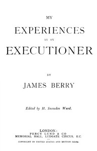

# My Experiences as an Executioner <kbd>v2.2.1</kbd>

## Authors

 - Berry, James <small>(1852 - 1913)</small>

## Translators

## Subjects

 - Executions and executioners

## Readablility

 - **A1:** 74%
 - **A2:** 80%
 - **B1:** 87%
 - **B2:** 94%
 - **C1:** 98%
 - **C2:** 100%

## Words Count

 - **A1:** 487
 - **A2:** 427
 - **B1:** 713
 - **B2:** 950
 - **C1:** 848
 - **C2:** 435

## Source

<kbd>GUTHENBURGE:46579</kbd>
