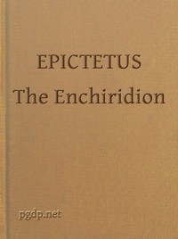

# The Enchiridion <kbd>v2.2.1</kbd>

## Authors

 - Epictetus <small>(55 - 135)</small>

## Translators

 - Higginson, Thomas Wentworth <small>(1823 - 1911)</small>

## Subjects

 - Conduct of life
 - Ethics, Ancient

## Readablility

 - **A1:** 74%
 - **A2:** 80%
 - **B1:** 87%
 - **B2:** 93%
 - **C1:** 98%
 - **C2:** 100%

## Words Count

 - **A1:** 404
 - **A2:** 259
 - **B1:** 380
 - **B2:** 475
 - **C1:** 386
 - **C2:** 195

## Source

<kbd>GUTHENBURGE:45109</kbd>
