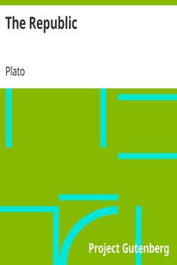

# The Republic <kbd>v2.2.1</kbd>

## Authors

 - Plato <small>(-428 - -348)</small>

## Translators

 - Jowett, Benjamin <small>(1817 - 1893)</small>

## Subjects

 - Classical literature
 - Justice
 - Political science
 - Utopias

## Readablility

 - **A1:** 77%
 - **A2:** 83%
 - **B1:** 89%
 - **B2:** 94%
 - **C1:** 98%
 - **C2:** 100%

## Words Count

 - **A1:** 492
 - **A2:** 466
 - **B1:** 901
 - **B2:** 1545
 - **C1:** 2070
 - **C2:** 1496

## Source

<kbd>GUTHENBURGE:1497</kbd>
