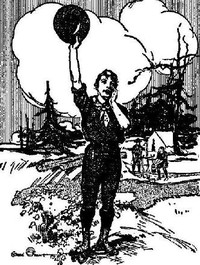

# Boy Scouts Handbook: The First Edition, 1911 <kbd>v2.3.0</kbd>

## Authors

 - Boy Scouts of America <small>(-1 - -1)</small>

## Translators

## Subjects

 - Boy Scouts
 - Boy Scouts of America

## Readablility

 - **A1:** 70%
 - **A2:** 77%
 - **B1:** 84%
 - **B2:** 91%
 - **C1:** 96%
 - **C2:** 100%

## Words Count

 - **A1:** 491
 - **A2:** 485
 - **B1:** 900
 - **B2:** 1487
 - **C1:** 1861
 - **C2:** 1613

## Source

<kbd>GUTHENBURGE:29558</kbd>
