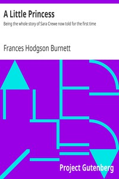

# A Little Princess: Being the whole story of Sara Crewe now told for the first time <kbd>v2.2.1</kbd>

## Authors

 - Burnett, Frances Hodgson <small>(1849 - 1924)</small>

## Translators

## Subjects

 - Boarding schools
 - Girls
 - London (England)
 - Orphans
 - Schools

## Readablility

 - **A1:** 80%
 - **A2:** 86%
 - **B1:** 91%
 - **B2:** 95%
 - **C1:** 98%
 - **C2:** 100%

## Words Count

 - **A1:** 487
 - **A2:** 423
 - **B1:** 725
 - **B2:** 924
 - **C1:** 945
 - **C2:** 461

## Source

<kbd>GUTHENBURGE:146</kbd>
