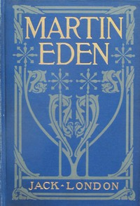

# Martin Eden <kbd>v2.2.1</kbd>

## Authors

 - London, Jack <small>(1876 - 1916)</small>

## Translators

## Subjects

 - Authors
 - Autobiographical fiction
 - Bildungsromans
 - San Francisco (Calif.)
 - Working class
 - Young men

## Readablility

 - **A1:** 77%
 - **A2:** 82%
 - **B1:** 88%
 - **B2:** 93%
 - **C1:** 97%
 - **C2:** 100%

## Words Count

 - **A1:** 491
 - **A2:** 479
 - **B1:** 920
 - **B2:** 1554
 - **C1:** 2098
 - **C2:** 1732

## Source

<kbd>GUTHENBURGE:1056</kbd>
