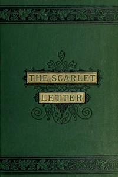

# The Scarlet Letter <kbd>v2.2.1</kbd>

## Authors

 - Hawthorne, Nathaniel <small>(1804 - 1864)</small>

## Translators

## Subjects

 - Adultery
 - Boston (Mass.)
 - Clergy
 - Historical fiction
 - Illegitimate children
 - Married women
 - Psychological fiction
 - Puritans
 - Revenge
 - Triangles (Interpersonal relations)
 - Women immigrants

## Readablility

 - **A1:** 73%
 - **A2:** 79%
 - **B1:** 85%
 - **B2:** 92%
 - **C1:** 97%
 - **C2:** 100%

## Words Count

 - **A1:** 490
 - **A2:** 472
 - **B1:** 856
 - **B2:** 1440
 - **C1:** 1850
 - **C2:** 1255

## Source

<kbd>GUTHENBURGE:33</kbd>
