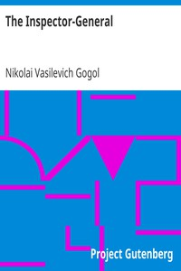

# The Inspector-General <kbd>v2.2.1</kbd>

## Authors

 - Gogol, Nikolai Vasilevich <small>(1809 - 1852)</small>

## Translators

 - Seltzer, Thomas <small>(1873 - 1943)</small>

## Subjects

 - Comedies
 - Russia
 - Russian drama

## Readablility

 - **A1:** 77%
 - **A2:** 83%
 - **B1:** 89%
 - **B2:** 95%
 - **C1:** 98%
 - **C2:** 100%

## Words Count

 - **A1:** 476
 - **A2:** 390
 - **B1:** 613
 - **B2:** 739
 - **C1:** 668
 - **C2:** 325

## Source

<kbd>GUTHENBURGE:3735</kbd>
