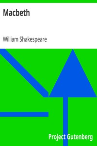

# Macbeth <kbd>v2.3.0</kbd>

## Authors

 - Shakespeare, William <small>(1564 - 1616)</small>

## Translators

## Subjects

 - Macbeth, King of Scotland, active 11th century
 - Regicides
 - Scotland
 - Tragedies

## Readablility

 - **A1:** 81%
 - **A2:** 86%
 - **B1:** 90%
 - **B2:** 94%
 - **C1:** 98%
 - **C2:** 100%

## Words Count

 - **A1:** 407
 - **A2:** 264
 - **B1:** 374
 - **B2:** 437
 - **C1:** 420
 - **C2:** 254

## Source

<kbd>GUTHENBURGE:2264</kbd>
