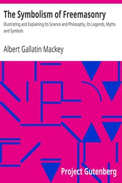

# The Symbolism of Freemasonry: Illustrating and Explaining Its Science and Philosophy, Its Legends, Myths and Symbols <kbd>v2.0.2</kbd>

## Authors

 - Mackey, Albert Gallatin <small>(1807 - 1881)</small>

## Translators

## Subjects

 - Freemasonry

## Readablility

 - **A1:** 49%
 - **A2:** 56%
 - **B1:** 67%
 - **B2:** 82%
 - **C1:** 84%
 - **C2:** 100%

## Words Count

 - **A1:** 551
 - **A2:** 539
 - **B1:** 869
 - **B2:** 1342
 - **C1:** 512
 - **C2:** 4936

## Source

<kbd>GUTHENBURGE:11937</kbd>
