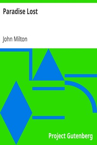

# Paradise Lost <kbd>v2.2.1</kbd>

## Authors

 - Milton, John <small>(1608 - 1674)</small>

## Translators

## Subjects

 - Adam (Biblical figure)
 - Bible. Genesis
 - Eve (Biblical figure)
 - Fall of man

## Readablility

 - **A1:** 69%
 - **A2:** 75%
 - **B1:** 83%
 - **B2:** 90%
 - **C1:** 96%
 - **C2:** 100%

## Words Count

 - **A1:** 477
 - **A2:** 431
 - **B1:** 751
 - **B2:** 1242
 - **C1:** 1589
 - **C2:** 1365

## Source

<kbd>GUTHENBURGE:26</kbd>
