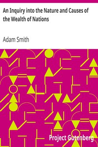

# An Inquiry into the Nature and Causes of the Wealth of Nations <kbd>v2.0.9</kbd>

## Authors

 - Smith, Adam <small>(1723 - 1790)</small>

## Translators

## Subjects

 - Economics

## Readablility

 - **A1:** 68%
 - **A2:** 75%
 - **B1:** 82%
 - **B2:** 89%
 - **C1:** 91%
 - **C2:** 100%

## Words Count

 - **A1:** 851
 - **A2:** 672
 - **B1:** 1045
 - **B2:** 1498
 - **C1:** 500
 - **C2:** 5173

## Source

<kbd>GUTHENBURGE:3300</kbd>
