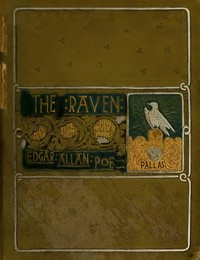

# The Works of Edgar Allan Poe, The Raven Edition: Table Of Contents And Index Of The Five Volumes <kbd>v2.3.0</kbd>

## Authors

 - Poe, Edgar Allan <small>(1809 - 1849)</small>

## Translators

## Subjects

 - American fiction
 - Fantasy fiction
 - Horror tales, American
 - Indexes
 - Poe, Edgar Allan, 1809-1849
 - Short stories

## Readablility

 - **A1:** 74%
 - **A2:** 79%
 - **B1:** 86%
 - **B2:** 92%
 - **C1:** 97%
 - **C2:** 100%

## Words Count

 - **A1:** 495
 - **A2:** 498
 - **B1:** 994
 - **B2:** 1937
 - **C1:** 3407
 - **C2:** 3992

## Source

<kbd>GUTHENBURGE:25525</kbd>
