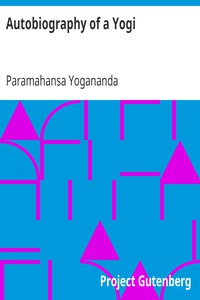

# Autobiography of a Yogi <kbd>v2.2.1</kbd>

## Authors

 - Yogananda, Paramahansa <small>(1893 - 1952)</small>

## Translators

## Subjects

 - Yogananda, Paramahansa, 1893-1952
 - Yogis

## Readablility

 - **A1:** 72%
 - **A2:** 77%
 - **B1:** 84%
 - **B2:** 90%
 - **C1:** 96%
 - **C2:** 100%

## Words Count

 - **A1:** 494
 - **A2:** 489
 - **B1:** 962
 - **B2:** 1738
 - **C1:** 2513
 - **C2:** 2319

## Source

<kbd>GUTHENBURGE:7452</kbd>
