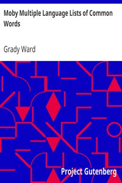

# Moby Multiple Language Lists of Common Words <kbd>v2.0.9</kbd>

## Authors

 - Ward, Grady <small>(1951 - -1)</small>

## Translators

## Subjects

 - Words and phrase lists

## Readablility

 - **A1:** 56%
 - **A2:** 66%
 - **B1:** 75%
 - **B2:** 84%
 - **C1:** 86%
 - **C2:** 100%

## Words Count

 - **A1:** 248
 - **A2:** 125
 - **B1:** 134
 - **B2:** 113
 - **C1:** 25
 - **C2:** 157

## Source

<kbd>GUTHENBURGE:3206</kbd>
