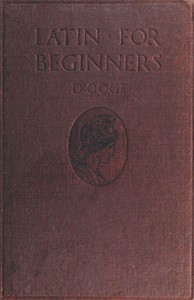

# Latin for Beginners <kbd>v2.2.1</kbd>

## Authors

 - D'Ooge, Benjamin L. (Benjamin Leonard) <small>(1860 - 1940)</small>

## Translators

## Subjects

 - Latin language

## Readablility

 - **A1:** 75%
 - **A2:** 79%
 - **B1:** 83%
 - **B2:** 88%
 - **C1:** 92%
 - **C2:** 99%

## Words Count

 - **A1:** 479
 - **A2:** 417
 - **B1:** 661
 - **B2:** 868
 - **C1:** 823
 - **C2:** 621

## Source

<kbd>GUTHENBURGE:18251</kbd>
