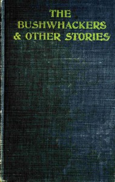

# The bushwhackers & other stories <kbd>v2.3.0</kbd>

## Authors

 - Murfree, Mary Noailles <small>(1850 - 1922)</small>

## Translators

## Subjects

 - Mountain life
 - Tennessee

## Readablility

 - **A1:** 73%
 - **A2:** 78%
 - **B1:** 84%
 - **B2:** 91%
 - **C1:** 96%
 - **C2:** 100%

## Words Count

 - **A1:** 486
 - **A2:** 438
 - **B1:** 786
 - **B2:** 1145
 - **C1:** 1354
 - **C2:** 971

## Source

<kbd>GUTHENBURGE:68162</kbd>
