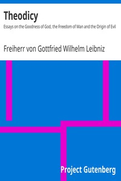

# Theodicy: Essays on the Goodness of God, the Freedom of Man and the Origin of Evil <kbd>v2.2.1</kbd>

## Authors

 - Leibniz, Gottfried Wilhelm, Freiherr von <small>(1646 - 1716)</small>

## Translators

 - Huggard, E. M. <small>(-1 - -1)</small>

## Subjects

 - Free will and determinism
 - Theism
 - Theodicy

## Readablility

 - **A1:** 77%
 - **A2:** 82%
 - **B1:** 88%
 - **B2:** 94%
 - **C1:** 98%
 - **C2:** 100%

## Words Count

 - **A1:** 487
 - **A2:** 453
 - **B1:** 791
 - **B2:** 1325
 - **C1:** 1693
 - **C2:** 1349

## Source

<kbd>GUTHENBURGE:17147</kbd>
