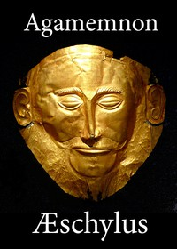

# The Agamemnon of Aeschylus: Translated into English Rhyming Verse with Explanatory Notes <kbd>v2.3.0</kbd>

## Authors

 - Aeschylus <small>(-525 - -456)</small>

## Translators

 - Murray, Gilbert <small>(1866 - 1957)</small>

## Subjects

 - Agamemnon, King of Mycenae (Mythological character)

## Readablility

 - **A1:** 72%
 - **A2:** 79%
 - **B1:** 86%
 - **B2:** 92%
 - **C1:** 98%
 - **C2:** 100%

## Words Count

 - **A1:** 465
 - **A2:** 355
 - **B1:** 537
 - **B2:** 713
 - **C1:** 652
 - **C2:** 356

## Source

<kbd>GUTHENBURGE:14417</kbd>
