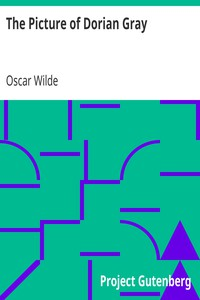

# The Picture of Dorian Gray <kbd>GUTHENBURGE</kbd>

## Authors

 - Wilde, Oscar <small>(1854 - 1900)</small>

## Translators

## Subjects

 - Appearance (Philosophy)
 - Conduct of life
 - Didactic fiction
 - Great Britain
 - London (England)
 - Paranormal fiction
 - Portraits
 - Supernatural

## Readablility

 - **A1:** 50%
 - **A2:** 64%
 - **B1:** 76%
 - **B2:** 88%
 - **C1:** 96%
 - **C2:** 100%

## Words Count

 - **A1:** 401
 - **A2:** 463
 - **B1:** 793
 - **B2:** 1156
 - **C1:** 1272
 - **C2:** 858
