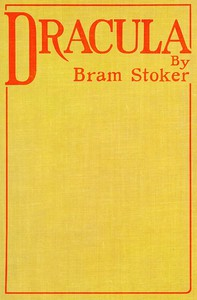

# Dracula <kbd>GUTHENBURGE</kbd>

## Authors

 - Stoker, Bram <small>(1847 - 1912)</small>

## Translators

## Subjects

 - Dracula, Count (Fictitious character)
 - Epistolary fiction
 - Gothic fiction
 - Horror tales
 - Transylvania (Romania)
 - Vampires
 - Whitby (England)

## Readablility

 - **A1:** 57%
 - **A2:** 64%
 - **B1:** 74%
 - **B2:** 87%
 - **C1:** 91%
 - **C2:** 100%

## Words Count

 - **A1:** 613
 - **A2:** 603
 - **B1:** 1049
 - **B2:** 1652
 - **C1:** 729
 - **C2:** 5091

## Tagger Version

v2.0.1
