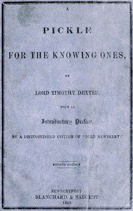

# A Pickle for the Knowing Ones <kbd>GUTHENBURGE</kbd>

## Authors

 - Dexter, Timothy <small>(1747 - 1806)</small>

## Translators

## Subjects

 - Dexter, Timothy, 1747-1806
 - Newburyport (Mass.)

## Readablility

 - **A1:** 47%
 - **A2:** 52%
 - **B1:** 62%
 - **B2:** 76%
 - **C1:** 80%
 - **C2:** 100%

## Words Count

 - **A1:** 385
 - **A2:** 276
 - **B1:** 398
 - **B2:** 492
 - **C1:** 167
 - **C2:** 1626

## Tagger Version

v2.0.0
