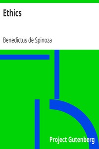

# Ethics <kbd>v2.0.2</kbd>

## Authors

 - Spinoza, Benedictus de <small>(1632 - 1677)</small>

## Translators

 - Elwes, R. H. M. (Robert Harvey Monro) <small>(1853 - -1)</small>

## Subjects

 - Ethics

## Readablility

 - **A1:** 48%
 - **A2:** 57%
 - **B1:** 69%
 - **B2:** 84%
 - **C1:** 88%
 - **C2:** 100%

## Words Count

 - **A1:** 452
 - **A2:** 384
 - **B1:** 569
 - **B2:** 843
 - **C1:** 300
 - **C2:** 1581

## Source

<kbd>GUTHENBURGE:3800</kbd>
