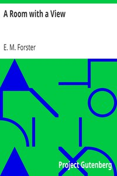

# A Room with a View <kbd>v2.2.1</kbd>

## Authors

 - Forster, E. M. (Edward Morgan) <small>(1879 - 1970)</small>

## Translators

## Subjects

 - British
 - England
 - Florence (Italy)
 - Humorous stories
 - Young women

## Readablility

 - **A1:** 78%
 - **A2:** 84%
 - **B1:** 89%
 - **B2:** 94%
 - **C1:** 98%
 - **C2:** 100%

## Words Count

 - **A1:** 491
 - **A2:** 466
 - **B1:** 817
 - **B2:** 1237
 - **C1:** 1322
 - **C2:** 837

## Source

<kbd>GUTHENBURGE:2641</kbd>
