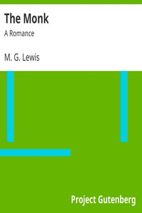

# The Monk: A Romance <kbd>v2.3.0</kbd>

## Authors

 - Lewis, M. G. (Matthew Gregory) <small>(1775 - 1818)</small>

## Translators

## Subjects

 - Gothic fiction
 - Horror tales
 - Madrid (Spain)
 - Monks

## Readablility

 - **A1:** 73%
 - **A2:** 79%
 - **B1:** 85%
 - **B2:** 93%
 - **C1:** 98%
 - **C2:** 100%

## Words Count

 - **A1:** 490
 - **A2:** 469
 - **B1:** 866
 - **B2:** 1457
 - **C1:** 1870
 - **C2:** 1179

## Source

<kbd>GUTHENBURGE:601</kbd>
